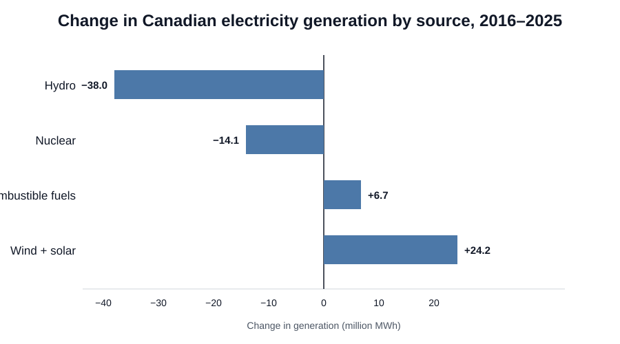
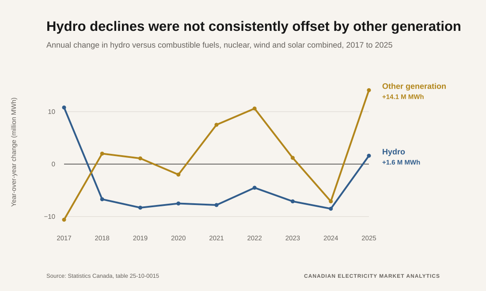

# Phase 2 analysis structure

## Core analytical question

When generation from a major electricity source declines within a province, is the shortfall offset by other domestic generation, electricity trade, or reduced total supply?

## Analysis sequence

### 1. National transition baseline
- Quantify 2016–2025 absolute and percentage changes by generation source.
- Calculate annual year-over-year changes.
- Compare hydro changes with the combined change in combustible fuels, nuclear, and wind/solar.
- Use this only as a national baseline, not as evidence of provincial causality.

Outputs:
- `data/processed/generation_change_2016_2025.csv`
- `data/processed/generation_annual_changes_2017_2025.csv`
- `docs/figures/generation_change_2016_2025.svg`
- `docs/figures/hydro_vs_other_sources_annual_change.svg`

#### Current national figures

### 2. Provincial generation trajectories
For each province:
- total generation by year;
- generation by source;
- source share of provincial generation;
- 2016–2025 absolute and percentage change;
- annual changes and largest positive/negative years.

The goal is to identify which provinces explain the national movements in hydro, nuclear, combustible fuels, and wind/solar.

### 3. Provincial substitution tests
For major source declines, compare the same-year change in:
- other domestic generation sources;
- total domestic generation;
- electricity receipts;
- electricity deliveries;
- net trade position where supported by the source data.

Interpretation categories:
- **Domestic substitution:** another provincial generation source rises materially.
- **Trade-supported supply:** receipts increase or net trade becomes more import-oriented.
- **System contraction/other:** neither domestic generation nor observed trade fully offsets the decline.

These categories are descriptive and should not be presented as causal without external evidence.

### 4. Targeted hypotheses
Initial hypotheses to test:
1. Recent national hydro weakness is concentrated in hydro-heavy provinces rather than evenly distributed across Canada.
2. Nuclear decline is concentrated geographically and may reflect refurbishment/outage timing rather than a broad national policy retreat.
3. Combustible generation acts as a partial balancing source in some low-hydro years, but not consistently at the national level.
4. Wind and solar growth is structural over 2016–2025, but its contribution to short-run balancing differs from its long-run contribution to the generation mix.
5. Electricity trade materially changes the apparent supply response for some provinces.

### 5. Visualization set
Portfolio-facing figures should include:
1. **2016–2025 generation change by source** — horizontal bar chart.
2. **Annual hydro change vs. other generation** — line chart centered on zero.
3. **Provincial contribution to national hydro change** — ranked bar chart.
4. **Provincial generation mix trajectories** — selected small set of province-level charts.
5. **Generation change vs. trade response** — scatter or paired change chart for targeted province-years.

## Interpretation guardrails
- Do not infer climate-change causality from generation data alone.
- Do not interpret nuclear changes as public-opinion effects without direct evidence.
- Separate long-run structural change from year-to-year operational variability.
- Treat national aggregation carefully because provincial electricity systems differ substantially.
- Use external policy, outage/refurbishment, hydrology, and weather sources only after the data identifies where deeper explanation is needed.
